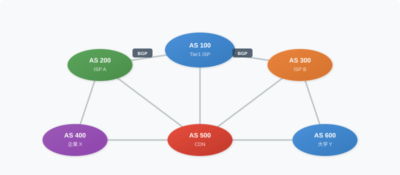
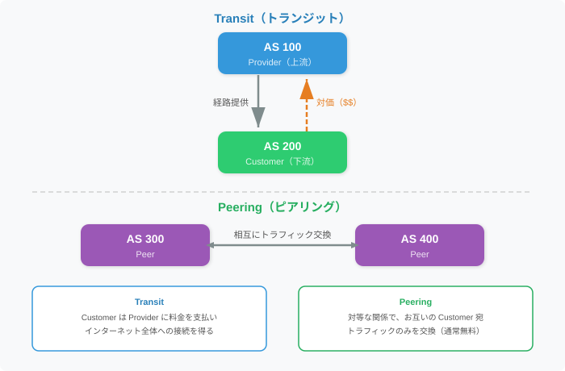
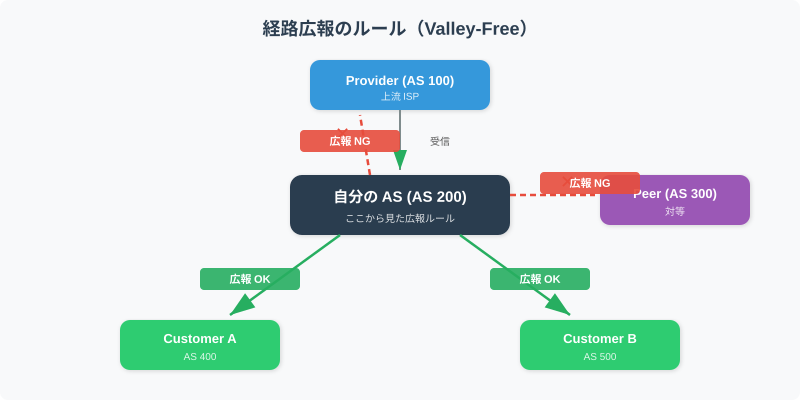
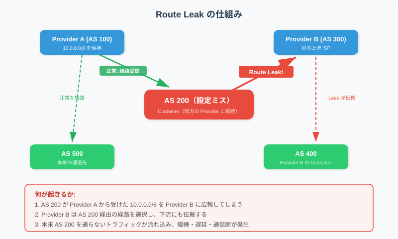
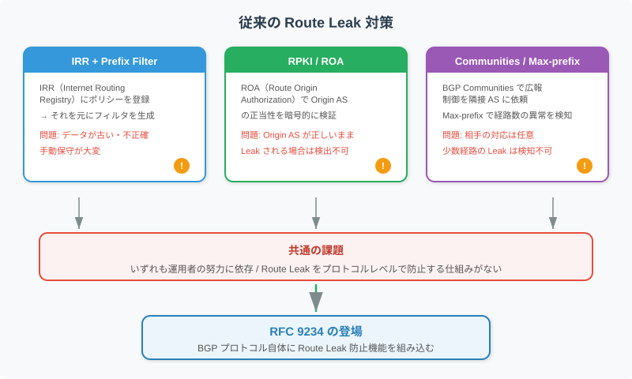
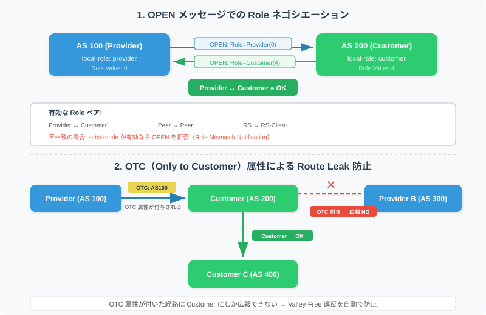

<!-- _class: title -->

# RFC 9234
## BGP Roles による Route Leak の防止

2026/03/01 kashu

---

# 目次

1. BGPの基本的な仕組み
2. AS 間の関係と経路広報のルール
3. Route Leakとは何か、なぜ危険なのか
4. 従来の対策とその限界
5. RFC 9234がどう解決するのか
6. FRRoutingでの設定方法

---

# 自己紹介

## 粕谷俊介 (kashu)

<div class="columns">
<div>

- 所属: Zli
- 趣味: ネットワーク, インフラ, バックエンド(Golang, TypeScript), おでかけ(国内・中国)
- 資格: 応用情報, ネットワークスペシャリスト, 第二種電気工事士
- Twitter: [@kasukashu02](https://twitter.com/kasukashu02)
  
</div>

<div>


---

# BGP とは

<div class="columns">
<div>

インターネットは、**AS（自律システム / Autonomous System）** の集合体

- AS = ISP・企業・大学など、一つの管理主体が運用するネットワークの単位
- 各 AS には **AS番号**（ASN）が割り当てられている（例: AS 2907 = SINET-AS）
- AS 同士が **BGP（Border Gateway Protocol）** で経路情報を交換することで、インターネット全体の到達性が維持されている

</div>
<div>



</div>
</div>

---

# BGP とは（2/2）

BGP の基本的な動作は以下のとおり

| フェーズ | メッセージ | 内容 |
|---------|-----------|------|
| セッション確立 | **OPEN** | パラメータ（ASN、機能など）を交換 |
| 経路交換 | **UPDATE** | プレフィックス（例: `10.0.0.0/8`）の広報・撤回 |
| 維持 | **KEEPALIVE** | セッションの死活監視 |

- UPDATE に含まれる **AS_PATH** 属性で、どの AS を経由する経路かがわかる
- 経路選択は AS_PATH の長さ、Local Preference など複数の基準で行われる

---

# AS 間のビジネス関係

<div class="columns">
<div>

BGP のピアリングには **ビジネス上の関係** がある。

- **Transit（トランジット）**  
  お金を払って上流 ISP に接続し、インターネット全体への到達性を得る
- **Peering（ピアリング）**  
  対等な関係で、お互いの Customer 宛トラフィックのみを交換（通常無料）

</div>
<div>



</div>
</div>

---

# Provider / Customer / Peer

| 関係 | 説明 | 例 |
| --- | --- | --- |
| **Provider** | 上流 AS（Transit を提供する側） | 大手 ISP |
| **Customer** | 下流 AS（Transit を購入する側） | 中小 ISP、企業 |
| **Peer** | 対等にトラフィックを交換する AS | 同規模の ISP 同士 |

この関係が **「どの経路を誰に広報するか」** のルールを決める。

---



---

# Valley-Free ルール

AS 間のビジネス関係に基づく、経路広報の基本原則

### 広報ルール

| 受信元 | → Provider に広報 | → Peer に広報 | → Customer に広報 |
|--------|:-:|:-:|:-:|
| **Provider から受信** | ✕ | ✕ | ○ |
| **Peer から受信** | ✕ | ✕ | ○ |
| **Customer から受信** | ○ | ○ | ○ |

> このルールが守られると、経路の伝搬は「山型（valley-free）」になる。
> 逆に、このルールを破る広報が **Route Leak**

---

# Route Leak とは

**Valley-Free ルールに違反する経路広報**

<div class="columns">
<div>

典型的なパターン: Provider から受けた経路を、**別の Provider や Peer に広報してしまう**

- ほとんどの場合、原因は **設定ミス** やオペレーションミス
- 意図的なものではなくても、影響は深刻

</div>
<div>



</div>
</div>

---

# Route Leak が起きるとどうなる？

設定ミスひとつで、インターネットの広範囲に影響が及ぶ。

### 影響

- **帯域の圧迫**: 本来通らないトラフィックが流れ込む
- **遅延の増大**: 最適でない経路を経由する
- **通信断**: 小規模 AS の回線がパンクし、その先の通信が不能に

### 実際の事例

- **2017年**: Googleの設定ミスにより、誤った経路情報を配信
  NTT Communications, KDDI などが影響を受け、数時間の障害に
- **2019年**: 小規模 AS（AS396531）の設定ミスにより Cloudflare 等の経路が Leak
  BGP Optimizer の誤設定が原因、広範囲で数時間の障害が発生

---

# 従来の Route Leak 対策

これまでは、以下の手段で対策してきた

| 対策 | 概要 | 限界 |
|------|------|------|
| **IRR + Prefix Filter** | IRR に登録されたポリシーで フィルタを生成 | データが古い・不正確。手動保守が大変 |
| **RPKI / ROA** | Origin AS の正当性を暗号的に検証 | Origin が正しいまま Leak されると検出不可 |
| **BGP Communities** | 広報範囲の制御を隣接 AS に依頼 | 相手が対応するかは任意 |
| **Max-prefix** | 受信経路数の上限を設定 | 少数経路の Leak は検知できない |

---

<!-- _class: img-center -->

# 従来対策の限界



---

# RFC 9234 の概要

**"Route Leak Prevention and Detection Using Roles in UPDATE and OPEN Messages"**  （2022年5月発行）

### 2つの新しい仕組み

1. **BGP Role**: OPEN メッセージで AS 間の役割を宣言・合意する
   - Provider / Customer / Peer / RS / RS-Client の 5 種類
   - 不整合なら `strict-mode` でセッション拒否も可能

2. **OTC（Only to Customer）属性**: UPDATE の経路に付与し、
   Provider/Peer から受けた経路が Provider/Peer に再広報されることを防ぐ

> **ポイント**: 従来の「運用者の注意力」に頼る対策から、**プロトコルの仕組み**で守る方向へ

---

<!-- _class: img-center -->

# BGP Role と OTC 属性の動作



---

# FRR での設定例


### Provider 側（AS 100）

```text
router bgp 100
 neighbor 192.0.2.2 remote-as 200
 neighbor 192.0.2.2 local-role provider
 neighbor 192.0.2.2 strict-mode
```

### Customer 側（AS 200）

```text
router bgp 200
 neighbor 192.0.2.1 remote-as 100
 neighbor 192.0.2.1 local-role customer
 neighbor 192.0.2.1 strict-mode
```

> `strict-mode`: Role が不一致の場合、セッションを確立しない（推奨）

---

# まとめ

- **Route Leak** は設定ミスでインターネット全体に障害を引き起こす深刻な問題
- 従来の対策（IRR、RPKI 等）は有効だが、**Route Leak そのものは防げない**
- **RFC 9234** は BGP に Role と OTC 属性を導入し、
  **プロトコルレベル**で Route Leak を検出・防止する
- **FRRouting** なら `local-role` と `strict-mode` の設定だけで導入可能

### 参考

- [RFC 9234](https://www.rfc-editor.org/rfc/rfc9234) - Route Leak Prevention and Detection Using Roles in UPDATE and OPEN Messages
- [FRR Documentation - BGP Roles](https://docs.frrouting.org/en/latest/bgp.html)
